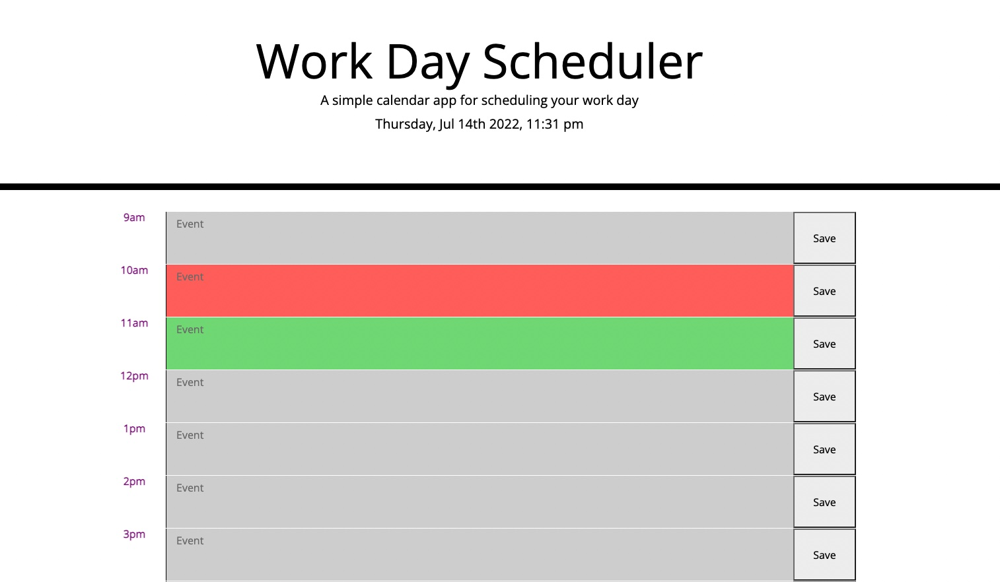

# Daily-Planner

Accept Criteria

GIVEN I am using a daily planner to create a schedule
WHEN I open the planner
THEN the current day is displayed at the top of the calendar
WHEN I scroll down
THEN I am presented with time blocks for standard business hours
WHEN I view the time blocks for that day
THEN each time block is color-coded to indicate whether it is in the past, present, or future
WHEN I click into a time block
THEN I can enter an event
WHEN I click the save button for that time block
THEN the text for that event is saved in local storage
WHEN I refresh the page
THEN the saved events persist

The following is a schedule that is color coded, based on the current time and whether it is in the past, present, or future. Any input should be save and be stored in local storage for future usage.

References:

https://stackoverflow.com/questions/19304343/using-the-id-for-if-condition#:~:text=If%20you%27re%20trying%20to%20check%20the%20value%20of,item.attr%20%28%22id%22%29%3B%20if%20%28id%20%3D%3D%20%27bar%27%29%20%7B%20%7D

